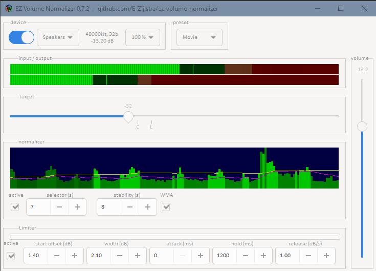
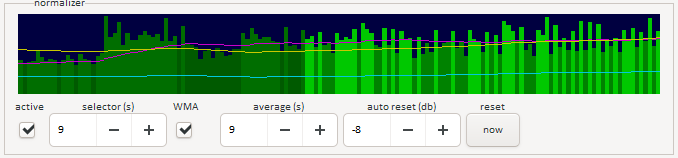

# Overview
This is a volume normalizer for Microsoft Windows.
It works by reducing the windows master volume, it can not boost your audio.
- Requirements: 64 bit windows.
- Tested on: Windows 10.



## Warning
This normalizer is experimental and may blow up your speakers or ears.


# Installing
- Install GTKD runtime 3.24.8 from here: https://gtkd.org/Downloads/runtime/gtk3-runtime_3.24.8_64bit.exe
  (It's needed for the GUI)
- Run the executable that you find under releases, or compile the source code yourself. (see below)

# Changelog
v0.5
 - Volume slider can be switched to log/decibels scale (right click on slider)
 - Added controls for delay and slowness. Previously these parameters were fixed to 30 and 30.
 - Smoother & quicker volume control
 - Limiter release is now in decibels
 - Changed the red limiter bar to show attenuation (dB), instead of netto reduction in volume. It gave confusing visualization when the normalizer kicked in.
 - Added limiter lookback parameter

 See manual for more details on the new controls.


v0.4
 - Device selection
 - Rearranged UI
 - Tweaked limiter defaults

v0.3
- loudness analyzer improvements
- added volume/time analyzer graph, mainly for analysis of future improvements
- send decibels to win api, fixes non-linear volume curves on some devices

# User manual

### Target level


The normalizer works by reducing the master volume.
Therefore you need to set target level to some low value, like 0.2; setting it to 1 effectively disables the normalizer.

The slider also sets the limiter operating range, indicated with C and L.
These can be fine tuned with the limiter start/width setting.

### Normalizer


The normalizer controls the volume slider to make the loudness match the target level.
If disabled then you can set the volume yourself.
The meter displays the signal after being attenuated by the volume slider.

#### Settings
 - delay: higher values will cause a delay before the normalizer starts ramping down the volume.
 - slowness: higher values will make the normalizer move more slowely to the desired level, but also make it more stable.

For exact details read the next section.

#### Graphic display
Displays input signal over time. There are 5 bars per second.
- Delay (in seconds) is the length of the purple moving average. Samples above the average will be bright green.
- Slowness is the number of bright bars that are kept, older bars are discarded.
- The bright bars that are left over are averaged to determine the loudness of what is playing. This is displayed as a yellow line.

##### Conclusion
- Use higher delay to make the normalizer ignore quiet parts.
- Use higher slowness to make the volume more stable.


### Limiter


The limiter starts compressing at C (or the orange area of the level meters) and won't let the signal go above L (fully limited) (red area). You can shift these points with start/width controls.

The meter displays the signal after being processed by the limiter.
If you want to see red here, you need to disable the limiter ;)
Under the meter there is thin red bar, this is the reduction (dB) applied by the limiter.

The limiter does not affect the volume slider, that would make it impossible to disable the normalizer and manually set the volume.

#### Settings
- start/width: operating range, relative to the target level.
- release: how quickly to reduce the volume reduction
- lookback: how far back to look for peaks, in millisecond. Higher values avoids pumping effects.
  If you have low settings for the normalizer you won't notice much difference. Disable the normalizer and crank up the volume to see the effect.


### Low volume boost
This may be useful or not. It changes the output volume curve.

### Power off
- Disable normalizer
- Set volume to your desired level
- Toggle the power button, or close the program


# Compiling
- Checkout GTKD : https://github.com/gtkd-developers/GtkD/
- Build the GTKD libs, something like this:
```
PATH=/c/D/dmd-2.100.2/windows/bin64/:/c/D/dmd-2.100.2/windows/bin:$PATH
rdmd.exe -m64 ./Build.d
```
- Copy the folder 'generated\gtkd' to your D installation. 'C:\D\dmd-2.100.2\src\gtkd'
- In VisualStudio goto tools -> options -> dmd and add the import path: C:\D\dmd-2.100.2\src\gtkd
- Also copy the two generated lib files to C:\D\dmd-2.100.2\windows\lib64\gtkd.lib C:\D\dmd-2.100.2\windows\lib64\gtkdsv.lib
- Open the project in visual studio 2022
- In project properties -> linker -> general add the 2 generated lib files to 'library files'
- compile and run
- Full/slightly different instructions to install GTKD: https://github.com/gtkd-developers/GtkD/wiki/Installing-on-Windows

## Acknowledgements
- I borrowed windows.d for the WASPI bindings from here: https://github.com/ZILtoid1991/iota/tree/main/source/iota/audio/backend
